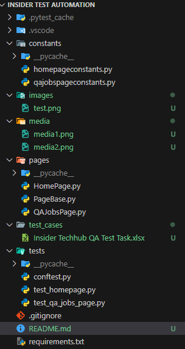
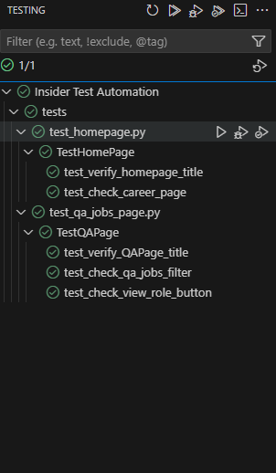

## Proje Açıklaması
Bu repo, [Shino ParkCalc](https://www.shino.de/parkcalc/) web uygulamasının test süreçlerini içermektedir. Test senaryoları, park hesaplama fonksiyonunun doğruluğunu ve uygulamanın farklı tarayıcılarda nasıl çalıştığını değerlendirmek amacıyla oluşturulmuştur.

## İçerik
Bu proje aşağıdaki testleri kapsar:

- **Otomasyon Testleri:** Uygulamanın işlevselliğini hızlı ve tekrarlanabilir bir şekilde doğrulayan otomatik testler.
- **Fonksiyonel Testler:** Buton işlevselliği, tarih ve saat hesaplamaları
- **Negatif Senaryolar:** Eksik veya yanlış veri girildiğinde sistemin verdiği tepkiler
- **Tarayıcı Uyumluluk Testleri:** Chrome, Firefox, Edge, Brave, Mobile platformları




## Test Senaryoları
Test senaryoları aşağıdaki formatta hazırlanmıştır:

- **Test Case ID:** Benzersiz test kimliği
- **Test Objective:** Testin amacı
- **Pre-Condition:** Test öncesi gerekli durumlar
- **Test Steps:** Adım adım test süreci
- **Test Data:** Kullanılan test verisi
- **Expected Result:** Beklenen sonuç
- **Actual Result:** Gerçekleşen sonuç
- **Test Environment:** Testin gerçekleştirildiği tarayıcı/platform

## Kurulum ve Çalıştırma

1. **Projeyi Klonlayın:**
   ```bash
   git clone https://github.com/mtaksel/MEHMET_TURGUT_AKSEL.QA.git
   cd MEHMET_TURGUT_AKSEL.QA
   ```
2. **Test Ortamını Kurun:**
   - Gerekli bağımlılıkları yüklemek için aşağıdaki komutu çalıştırın:
     ```bash
     pip install -r requirements.txt
     ```
   - Selenium gibi ek test araçları gerekiyorsa ilgili sürücüleri yükleyin.
